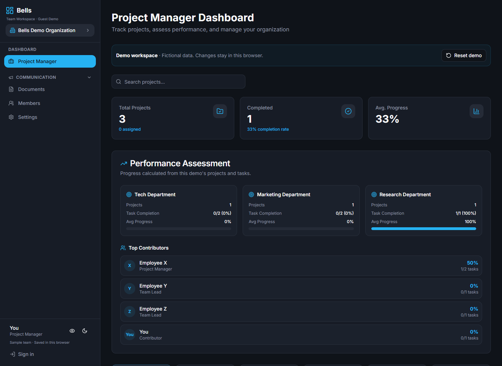
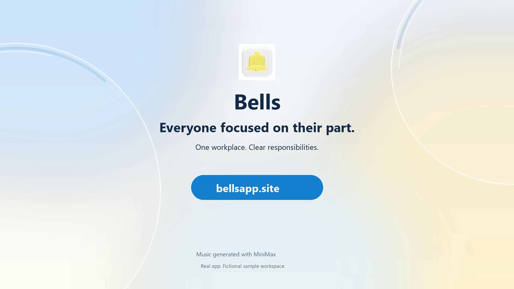

<p align="center">
  
</p>

<h1 align="center">Bells</h1>

<p align="center"><strong>Everyone focused on their part of the work.</strong></p>

<p align="center">
  <a href="https://bellsapp.site">Live website</a> ·
  <a href="https://bellsapp.site/demo">Try the demo</a> ·
  <a href="docs/media/bells-workflow.mp4">60-second walkthrough</a>
</p>

Bells is a workplace application built around **role-based access control (RBAC)**. Project managers, team leads, and contributors access the projects, tasks, and actions permitted by their role and assignments, giving everyone a clear area of responsibility.

Work moves through a defined chain: managers set goals, leads assign tasks, contributors submit work, and reviewers approve it or request changes with saved feedback.

[](https://bellsapp.site/demo)

## Why Bells

Clear responsibilities should carry through the entire workflow: who can see the work, who owns the next step, and who can approve the result. Bells connects those decisions through role-specific dashboards and permission checks in the database.

| Role | Responsibility | Access and actions |
| --- | --- | --- |
| **Project manager** | Set direction and oversee delivery | Create a workplace, invite team leads, assign projects and goals, monitor progress, and review project submissions. |
| **Team lead** | Turn project goals into team tasks | Work with assigned projects, invite contributors to their team, assign and review tasks, and submit project deliverables to the manager. |
| **Contributor** | Complete assigned work | Access assigned tasks and their project context, submit files, links, or notes, and respond to review feedback. |

Project and task access is scoped by active workplace membership, role, and assignments. Workplace messages, announcements, and shared documents support communication across the organization.

## Features

- **Role-based access control:** Dedicated dashboards backed by database row-level security and authorization checks on workflow commands.
- **Invitations with team ownership:** Managers invite leads; leads invite their contributors. Workplace-code acceptance preserves the invited role and team relationship.
- **Two stages of review:** Leads review contributor tasks; managers separately review project handoffs. Both stages support approval, required revision feedback, and resubmission.
- **Persistent review history:** Submission attempts, reviewer actions, comments, and timestamps remain available throughout the review cycle.
- **Progress tied to approval:** Approved tasks update completion metrics; a project requires a separate manager approval to be complete.
- **Guest demo:** Explore a sample organization or create a local demo workspace without signing up. Demo changes stay in the current browser.
- **Responsive interface:** Desktop and mobile layouts, light and dark workspace themes, and a public landing page with blue and yellow SlicedWaves.

## See the workflow

[](docs/media/bells-workflow.mp4)

The 60-second walkthrough uses the actual application with a fictional sample workplace: one project manager, two team leads, and five contributors. It follows invitations, task assignment, both revision cycles, and completion updates.

```mermaid
flowchart LR
    PM[Manager sets project goals] --> TL[Lead assigns team tasks]
    TL --> C[Contributor submits work]
    C --> TR[Lead reviews task]
    TR -->|Revision feedback| C
    TR -->|Approved tasks| PH[Lead submits project]
    PH --> PR[Manager reviews project]
    PR -->|Revision feedback| PH
    PR -->|Approved| Done[Project complete]
```



## Technology

| Layer | Stack |
| --- | --- |
| Frontend | React 18, TypeScript, Vite |
| Interface | Tailwind CSS, shadcn/ui, Radix UI, Lucide icons, Recharts |
| Routing and data | React Router, TanStack Query |
| Backend | Supabase Auth, PostgreSQL, Storage, Edge Functions |
| Authorization | PostgreSQL row-level security, scoped workflow functions |
| Motion | React Bits SlicedWaves, OGL |
| Hosting and tests | Vercel, Vitest, Testing Library |

## Run locally

Use Node.js 22 or newer and npm. The committed `package-lock.json` is the dependency lockfile.

```sh
git clone https://github.com/jiexiY/bells.git
cd bells
npm ci
npm run dev
```

Open [localhost:8080](http://localhost:8080). The landing page and [guest demo](http://localhost:8080/demo) work without a configured backend.

For real accounts and persistent workspaces, copy `.env.example` to `.env` and set the public browser configuration for **your own Supabase project**:

```dotenv
VITE_SUPABASE_PROJECT_ID=your_project_ref
VITE_SUPABASE_URL=https://your_project_ref.supabase.co
VITE_SUPABASE_PUBLISHABLE_KEY=your_publishable_key
```

Then follow the [backend and deployment guide](docs/DEPLOYMENT.md). The frontend build does not create the database or deploy Edge Functions. Never put a service-role key or secret key in a `VITE_` variable.

### Commands

```sh
npm run dev       # Development server on port 8080
npm run build     # Production output in dist/
npm run preview   # Preview the production build
npm test          # Existing app regression tests
npm run lint      # ESLint checks
```

TypeScript checks are available with `npx tsc --noEmit -p tsconfig.app.json`.

## Project structure

```text
src/
  pages/                 Landing page, authentication, role dashboards, guest demo
  components/dashboard/  Invitations, tasks, reviews, progress, and shared panels
  components/demo/       Browser-local demo UI and state
  contexts/              Authentication, workplace membership, demo organizations
  hooks/                 Application data and workflow operations
  integrations/supabase/ Supabase client and generated database types
  test/                  App regression tests
supabase/
  restore/               Database bootstrap for a new, empty project
  migrations/            Historical schema and subsequent workflow updates
  functions/             Invitation and workplace lifecycle endpoints
docs/
  DEPLOYMENT.md          Backend setup, hosting, and configuration
  media/                 Walkthrough video and poster
public/                  Bells assets and third-party license notices
```

## Current limitations

- Public signup confirmation and password recovery require a configured SMTP provider. The current deployment has not configured custom SMTP.
- Invitations are recorded in the app; invitation email delivery is disabled. The inviter shares the workplace code with the selected recipient.
- Google/Apple sign-in and organization SSO are not enabled in the current app.
- The guest demo is a separate browser-local sandbox; its changes do not sync to authenticated workspaces.
- A planning-canvas prototype remains in the source but is not part of the routed application.

See the [verification notes](docs/VERIFICATION.md) for the scope of testing.

## Credits and licensing

The SlicedWaves background comes from [React Bits](https://reactbits.dev/backgrounds/sliced-waves); its [license notice](public/licenses/react-bits-LICENSE.md) is included. Other dependencies retain their respective licenses. The walkthrough uses music generated with MiniMax and retains its attribution.

This repository does not currently grant a project-wide open-source license. Third-party license notices continue to apply to their respective components.
